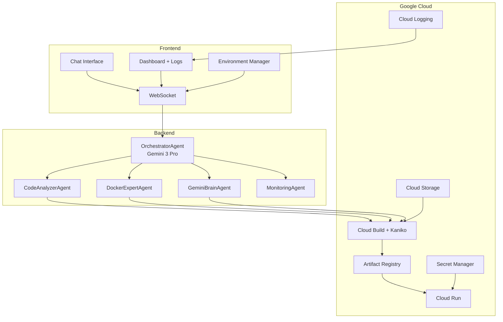

# DevGem

**The Sovereign Agentic Cloud Engine**

Deploy any GitHub repository to Google Cloud Run through natural language.
No Dockerfiles. No CLI. No config files. Just conversation.

---

## What is DevGem?

DevGem is an AI-powered deployment platform that transforms Cloud Run deployment from a multi-step DevOps process into a single natural language conversation.

Paste a GitHub URL. Say **"Deploy."** Get a live Cloud Run URL in minutes.

Five specialized **Gemini 3** AI agents collaborate in real-time to clone your repository, analyze your framework, generate an optimized Dockerfile, build a container image in the cloud using Kaniko, and deploy to Google Cloud Run with auto-scaling, HTTPS, and IAM policy automation.

**Zero gcloud CLI dependency** — everything uses Google Cloud Python client libraries.

---

## Gemini 3 Integration

| Agent | Model | Role |
|:------|:------|:-----|
| OrchestratorAgent | `gemini-3-pro-preview` | Function calling, deployment orchestration |
| GeminiBrainAgent | `gemini-3-pro-preview` | Error diagnosis, root cause analysis |
| CodeAnalyzerAgent | `gemini-3-flash-preview` | Framework detection, port sensing |
| DockerExpertAgent | `gemini-3-flash-preview` | Native library resolution, Dockerfile generation |
| MonitoringAgent | `gemini-3-flash-preview` | Runtime health analysis |

Multi-region failover: `us-central1` → `us-east1` → `europe-west1` → `asia-northeast1` → direct Gemini API.

---

## Architecture



---

## The 7-Stage Pipeline

| Stage | What Happens |
|:------|:-------------|
| **1. Repository Access** | Authenticated `git clone --depth 1` + parallel GCP preflight checks |
| **2. Code Analysis** | Heuristic engine (25+ framework signatures) + Gemini validation |
| **3. Dockerfile Generation** | Template matching from 15+ templates + native library resolution |
| **4. Environment Config** | `.env` parsing + Google Secret Manager two-way sync |
| **5. Security Scan** | Dockerfile validation + env var sanitization |
| **6. Container Build** | Cloud Build + Kaniko — no Docker daemon, no CLI |
| **7. Cloud Run Deploy** | Cloud Run v2 API + IAM automation + URL verification |

Each stage streams real-time progress, logs, and AI reasoning via WebSocket.

---

## Quick Start

### Prerequisites

- Node.js 18+ (frontend)
- Python 3.11+ (backend)
- Google Cloud Project with billing enabled
- GitHub Account

### Frontend

```bash
npm install
npm run dev
```

Runs at `http://localhost:5173`

### Backend

```bash
cd backend
pip install -r requirements.txt
python app.py
```

Runs at `http://localhost:8000`

### Environment Variables

Create `backend/.env`:

```env
GOOGLE_CLOUD_PROJECT=your-gcp-project-id
GOOGLE_CLOUD_REGION=us-central1
GOOGLE_APPLICATION_CREDENTIALS=path/to/service-account.json
GEMINI_API_KEY=your-gemini-api-key
GITHUB_CLIENT_ID=your-github-client-id
GITHUB_CLIENT_SECRET=your-github-client-secret
GITHUB_TOKEN=your-github-pat
```

---

## Project Structure

```
devsgem/
├── src/                        # Frontend — React + TypeScript
│   ├── components/             # 97 UI components
│   ├── contexts/               # WebSocket, Theme contexts
│   ├── hooks/                  # 7 custom hooks
│   ├── lib/                    # WebSocket client, API, utilities
│   ├── pages/                  # 12 page components
│   └── types/                  # TypeScript definitions
│
├── backend/                    # Backend — FastAPI + Python
│   ├── agents/                 # 7 AI agents
│   ├── services/               # 24 cloud services
│   ├── app.py                  # Entry point
│   └── requirements.txt        # Dependencies
│
├── package.json
└── vite.config.ts
```

---

## Tech Stack

**Frontend** — React 18 · TypeScript · Vite 5 · Tailwind CSS · Shadcn/ui · Framer Motion

**Backend** — Python 3.11 · FastAPI · Vertex AI SDK · google-cloud-build · google-cloud-run · google-cloud-storage · google-cloud-secret-manager

**Infrastructure** — Cloud Run · Cloud Build + Kaniko · Artifact Registry · Secret Manager · Cloud Storage · Cloud Logging

---

## By the Numbers

| | |
|:--|:--|
| Backend | 15,000+ lines across 7 agents and 24 services |
| Frontend | 12,000+ lines across 97 components and 12 pages |
| Dockerfile Templates | 15+ (Python, Node, Go, PHP, Ruby, Java) |
| Framework Signatures | 25+ (FastAPI, Flask, Express, NestJS, Next.js, Vite, Gin, Laravel, Spring Boot, Rails…) |
| Deployment Time | 3–5 minutes |

---

*Built with Gemini 3 for the Gemini 3 Global Hackathon — February 2026*
